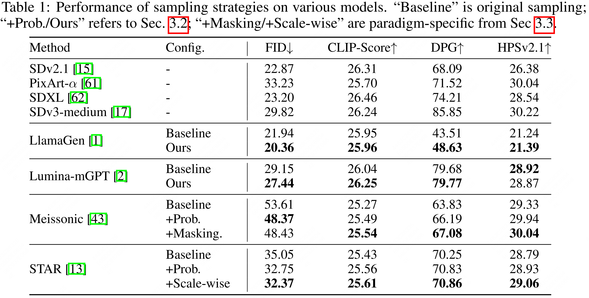
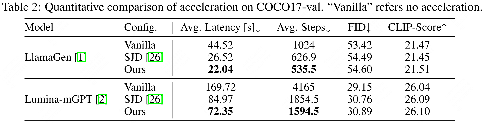

<div align="center">
    <h1> 
        Towards Better & Faster Autoregressive Image Generation: From the Perspective of Entropy
    </h1>
</div>

<div align="center">
    <a href="https://arxiv.org/abs/2510.09012">
        
    </a>&nbsp;
    <a href="https://github.com/krennic999/ARsample">
        
    </a>
</div>

## News

- [2025-10] We have released official [Codebase](https://github.com/krennic999/ARsample)!
- [2025-10] [Technical Report](https://arxiv.org/abs/2510.09012) is released!
- [2025-09] This work is accepted by NeurIPS2025!

##  Introduction
<!-- <b> -->
We firstly visit the decoding problem in autoregressive (AR) image generation, and address sampling inefficiency by leveraging spatial entropy of token distributions.

Built upon existing AR models ([LlamaGen](https://github.com/FoundationVision/LlamaGen), [Lumina-mGPT](https://github.com/Alpha-VLLM/Lumina-mGPT), [Meissonic](https://github.com/viiika/Meissonic) & [STAR](https://github.com/krennic999/STAR)), we improves image fidelity and alignment across multiple benchmarks **without increasing computational cost**. 

Furthermore, we achieves **~15% faster** generation based on current speculative decoding method ([SJD](https://github.com/tyshiwo1/Accelerating-T2I-AR-with-SJD/)).

Its effectiveness and generalization are further validated on diverse AR architectures, demonstrating significant gains in both quality and efficiency for mask-based and scale-wise models.
<!-- </b> -->

<div align="center">

</div>
</div>

<details><summary><b>CLICK for Detailed Introduction</b></summary>
In this work, we first revisit the sampling issues in current autoregressive (AR) image generation models and identify that image tokens, unlike text tokens, exhibit lower information density and non-uniform spatial distribution. Accordingly, we present an entropy-informed decoding strategy that facilitates higher autoregressive generation quality with faster synthesis speed. Specifically, the proposed method introduces two main innovations: 

1) Dynamic temperature control guided by spatial entropy of token distributions, enhancing the balance between content diversity, alignment accuracy, and structural coherence in both mask-based and scale-wise models **without extra computational overhead**.

2) Entropy-aware acceptance rules in speculative decoding, achieving **near-lossless generation** at about 85% of the inference cost of conventional acceleration methods.

Extensive experiments across multiple benchmarks using diverse AR image generation models demonstrate the effectiveness and generalizability of our approach in enhancing both generation quality and sampling speed.

<!-- <div align="center">

<p>framework of STAR</p>
</div> -->
</details>

### Generation Performance
<div style="text-align: center; width: 100%;">
    
</div>

### Performance on Acceleration
<div style="text-align: center; width: 100%;">
    
</div>

<!-- ### More Ablations -->

## Get Started
### Quick Inference
Clone the repository **(now we provide only inference code for LlamaGen, the other codes will be released soon!)**:

   ```bash
   git clone https://github.com/krennic999/ARsample.git
   cd LlamaGen
   ```

download checkpoints refer to [LlamaGen](https://github.com/FoundationVision/LlamaGen), and cd into ```./autoregressive/sample```, and run
   ```bash
    torchrun --nnodes=1 --nproc_per_node=8 --node_rank=0 --master_port=29500 sample_t2i_coco.py --save_root your-save-root
   ```

Set ```--enable_entropy_filtering``` to True during inference for entropy-aware sampling.

## Acknowledgements
We thank [LlamaGen](https://github.com/FoundationVision/LlamaGen), [Lumina-mGPT](https://github.com/Alpha-VLLM/Lumina-mGPT), [Meissonic](https://github.com/viiika/Meissonic) & [STAR](https://github.com/krennic999/STAR) for their great work and trained model, and [SJD](https://github.com/tyshiwo1/Accelerating-T2I-AR-with-SJD/) for the algorithm.

## Cite
```
@misc{ma2025betterfasterautoregressive,
      title={Towards Better & Faster Autoregressive Image Generation: From the Perspective of Entropy}, 
      author={Xiaoxiao Ma and Feng Zhao and Pengyang Ling and Haibo Qiu and Zhixiang Wei and Hu Yu and Jie Huang and Zhixiong Zeng and Lin Ma},
      year={2025},
      eprint={2510.09012},
      archivePrefix={arXiv},
      primaryClass={cs.CV},
      url={https://arxiv.org/abs/2510.09012}, 
}
```